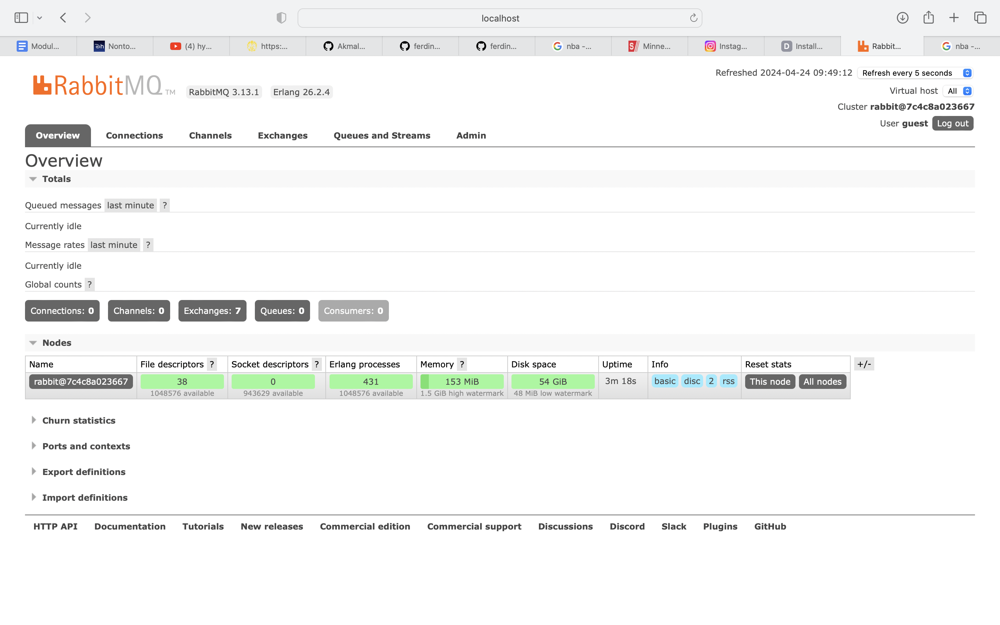
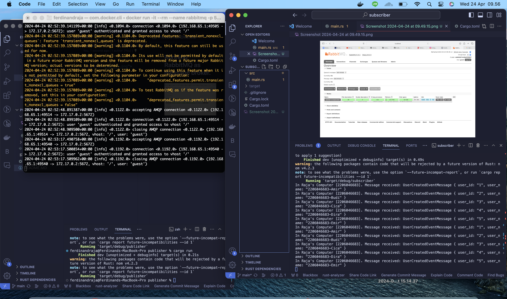
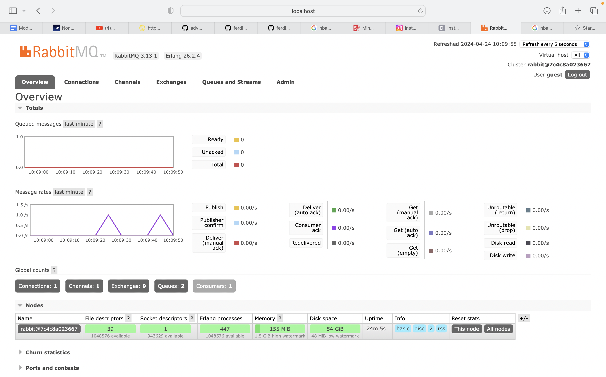

## Running RabbitMQ as message broker.

## Sending and processing event.

When we use the RabbitMQ, if we run the subscribern and then run th epublisher, the publisher will send a message to RabbitMQ, and the subscriber will receive the message, just like what happen in the picture.

## Sending and processing event.

After running the publisher for some tries, I found a  relation between the spikes and the publisher. From what I understand, the spikes will go up everytime I run the publisher. That means that the spike can indicate the message rates.
